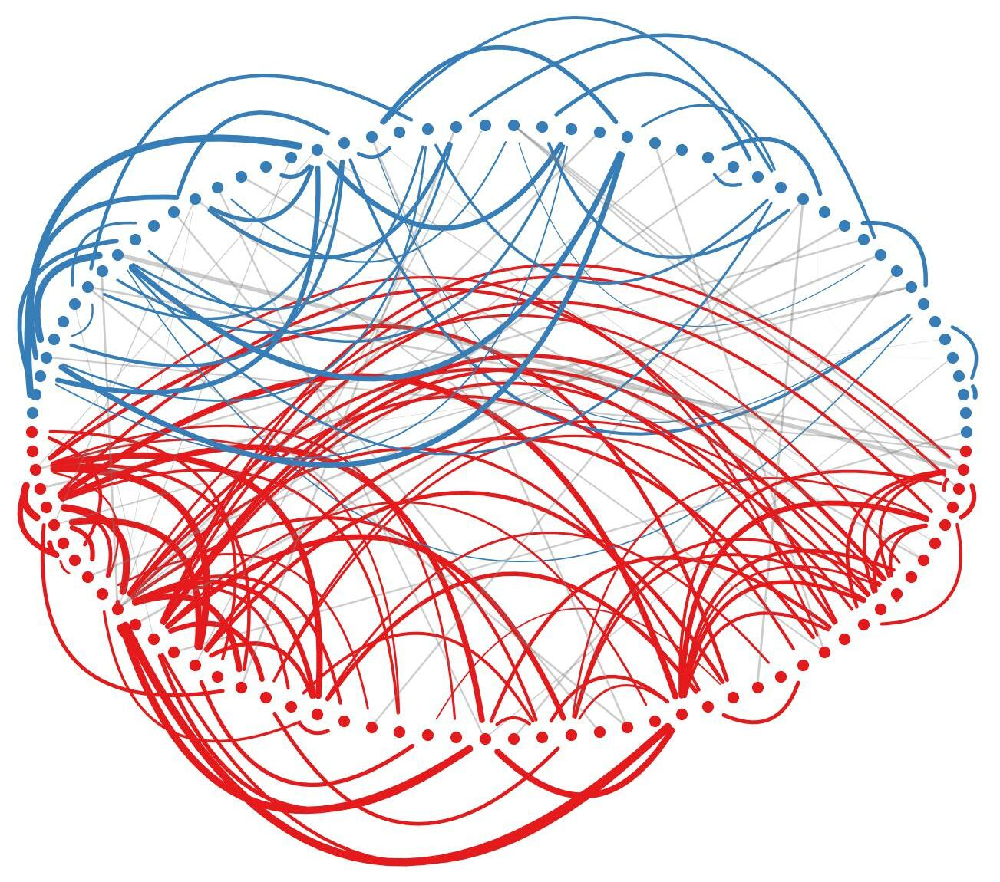
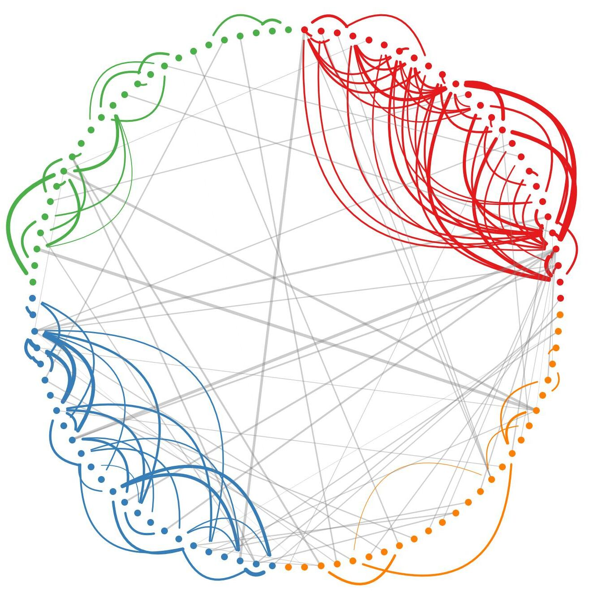
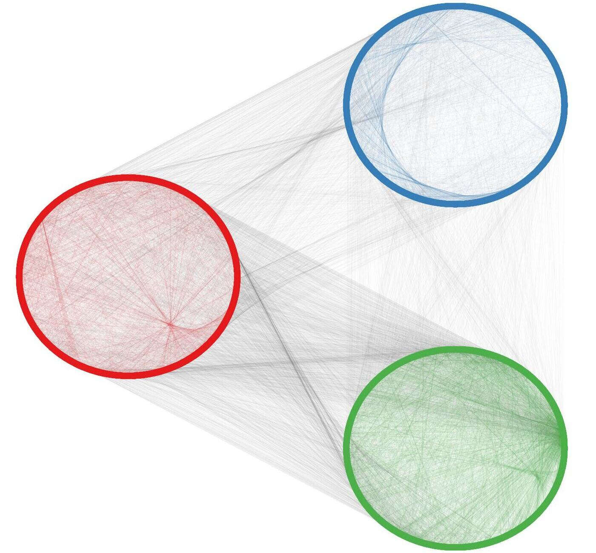
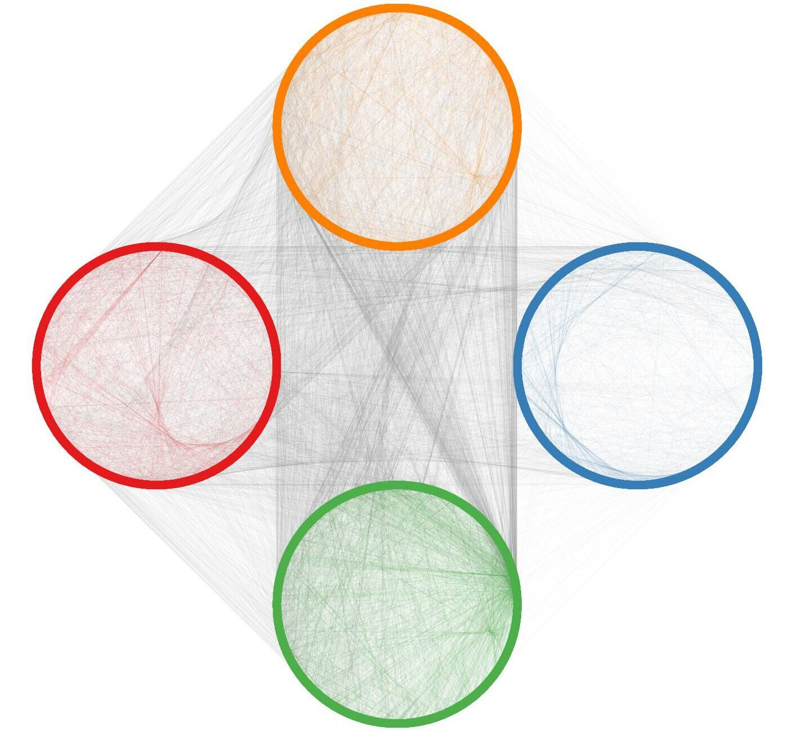
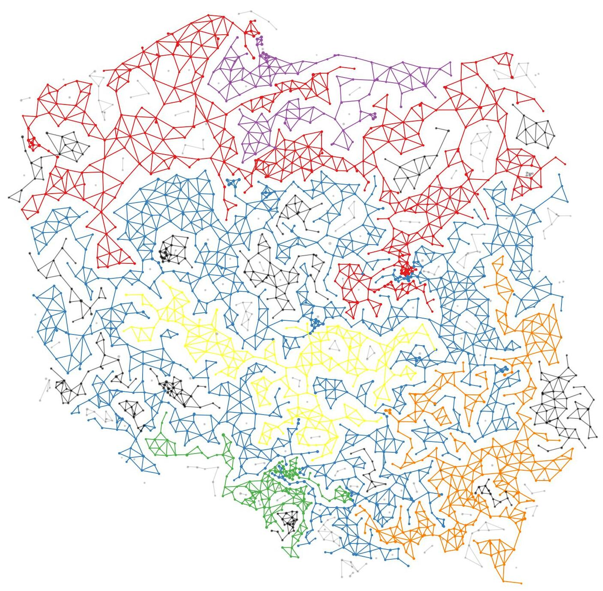
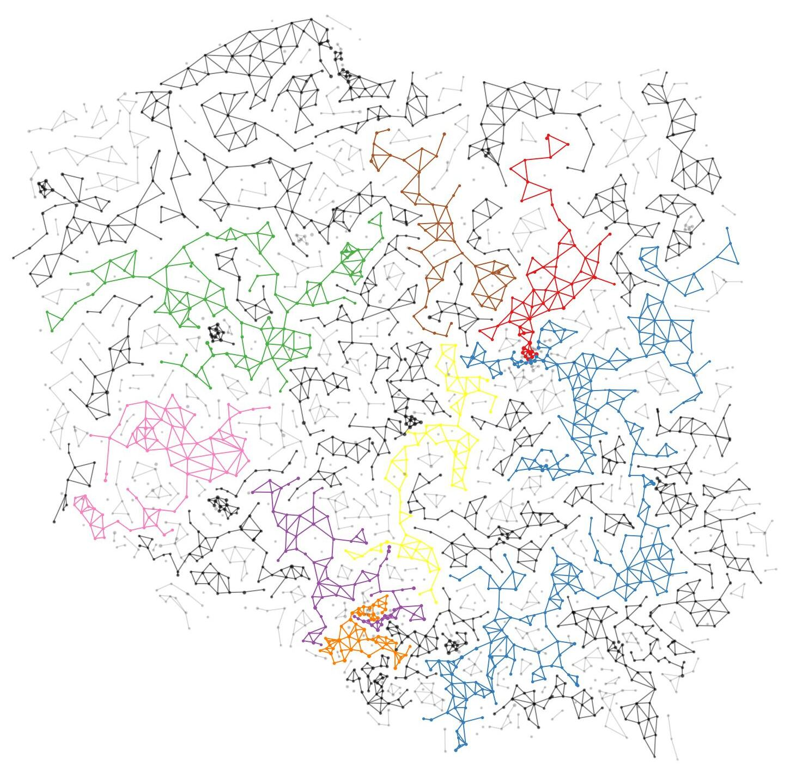

# Deep Epidemic Efficiency Networks (DEEN)
## Datasets
Data used in experiments in provided in `data/`. `data/ride-pooling` was extracted using [ExMAS](https://github.com/RafalKucharskiPK/ExMAS).

## Ride-pooling networks


### Train
```
NUM_CLUSTERS=4
DATE=2016-01-25-00-00
python train.py \
        --dataset ride-pooling --ride-pooling-date $DATE \
        --num-clusters $NUM_CLUSTERS --edge-weight frac_u --delta 0.85  \
        --mp-units "[32,16,8]" --mlp-units "[]" --dmon \
        --kappa "[0.0,0,1,0,1,0,0,0.4]"  \
        --output-csv saved/ride-pooling/date-${DATE}-clusters-${NUM_CLUSTERS}.csv
```
### Evaluate
```
python evaluate.py \
    --dataset ride-pooling --ride-pooling-date $DATE --clusters-csv saved/ride-pooling/date-${DATE}-clusters-${NUM_CLUSTERS}.csv
```
## P2P computer networks


### Train
```
NUM_CLUSTERS=4
GNUTELLA_VERSION=4
python train.py \
        --dataset p2p --gnutella-version $GNUTELLA_VERSION \
        --num-clusters $NUM_CLUSTERS --edge-weight u --delta 0.85  \
        --mp-units "[32,16,8]" --mlp-units "[]" --dmon \
        --kappa "[0.0,0,1,0,1,0,0,0.4]"  \
        --output-csv saved/p2p/version-${GNUTELLA_VERSION}-clusters-${NUM_CLUSTERS}.csv
```
### Evaluate
```
python evaluate.py \
    --dataset p2p --gnutella-version $GNUTELLA_VERSION --clusters-csv saved/p2p/version-${GNUTELLA_VERSION}-clusters-${NUM_CLUSTERS}.csv
```
## Country regions


### Train
```
NUM_CLUSTERS=4
python train.py \
        --dataset regions \
        --num-clusters $NUM_CLUSTERS --edge-weight u --delta 0.85  \
        --mp-units "[32,16,8]" --mlp-units "[]" --dmon \
        --kappa "[0.0,0,1,0,1,0,0,0.4]"  \
        --output-csv saved/regions/clusters-${NUM_CLUSTERS}.csv
```
### Evaluate
```
python evaluate.py \
    --dataset regions --clusters-csv saved/regions/clusters-${NUM_CLUSTERS}.csv
```
In order to find the optimal number of clusters, run binary search alternating between `train.py` and `evaluate.py`.
This code can be used to train baselines: DMoN, Just Balance GNN and MinCutPool.
